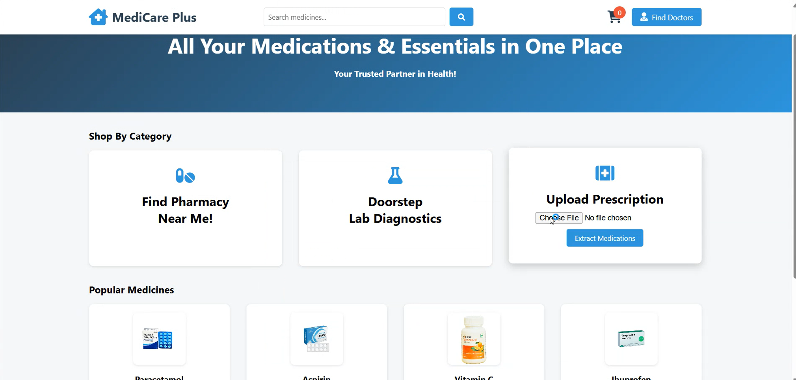

# Doctor Appointment Chatbot — AI Healthcare Assistant Platform


## Overview
Doctor Appointment Chatbot is a full-stack AI-powered healthcare assistant platform that enables users to chat with a medical bot, translate symptoms into English, book doctor appointments, search medicines, upload prescriptions for OCR extraction, and track orders — all in one system.

This project demonstrates integration of AI, NLP, APIs, OCR, automation, and web development into a single production-style application.

---

## Features

- AI chatbot for medical interaction
- Integrated Calendly API for real-time appointment scheduling
- Multilingual symptom translator
- Prescription OCR reader (Image + PDF)
- Medicine information search via FDA API
- Email automation system
- Doctor appointment booking UI
- Pharmacy cart system
- Order tracking system
- Interactive frontend UI

---
  
## Tech Stack
### Backend
- Python
- Flask

### AI / NLP
- HuggingFace Transformers
- Google Translator APIs

### Libraries
- pytesseract
- PyPDF2
- gTTS

### Frontend
- HTML
- CSS
- JavaScript

### APIs
- OpenFDA API
- Calendly API

---

## System Architecture
```text
User → Frontend UI → Flask Backend
                     ↓
          NLP + Translation Engine
                     ↓
        External APIs + OCR Engine
                     ↓
               Response Output
```

## Installation
Clone repo

```bash
git clone https://github.com/DeepakWagle/doctor-appointment-chatbot.git
cd doctor-appointment-chatbot
```

### Install dependencies
```bash
pip install -r requirements.txt
```

### Run server
```bash
python app.py
```

### Open browser

http://127.0.0.1:5000

## Environment Variables
Create a `.env` file in the root directory:

```env
EMAIL_USER=your_email
EMAIL_PASS=your_password
```


## Folder Structure

```bash
doctor-appointment-chatbot/
│
├── app.py
├── templates/
├── static/
├── uploads/
├── requirements.txt
├── README.md
└── .env
```

## API Endpoints

| Endpoint | Method | Description |
|----------|--------|------------|
| `/chat` | POST | Send chatbot message |
| `/translate` | POST | Translate symptoms |
| `/medicine` | GET | Search medicine info |
| `/upload` | POST | Upload prescription |
| `/track` | GET | Track order |

## Screenshots
### Home Page


### Chatbot Interface


### Other Features


## Author
## Author

Deepak B V — AI & ML Engineer | Full-Stack AI Developer

## License
This project is licensed under the MIT License — see the LICENSE file for details.